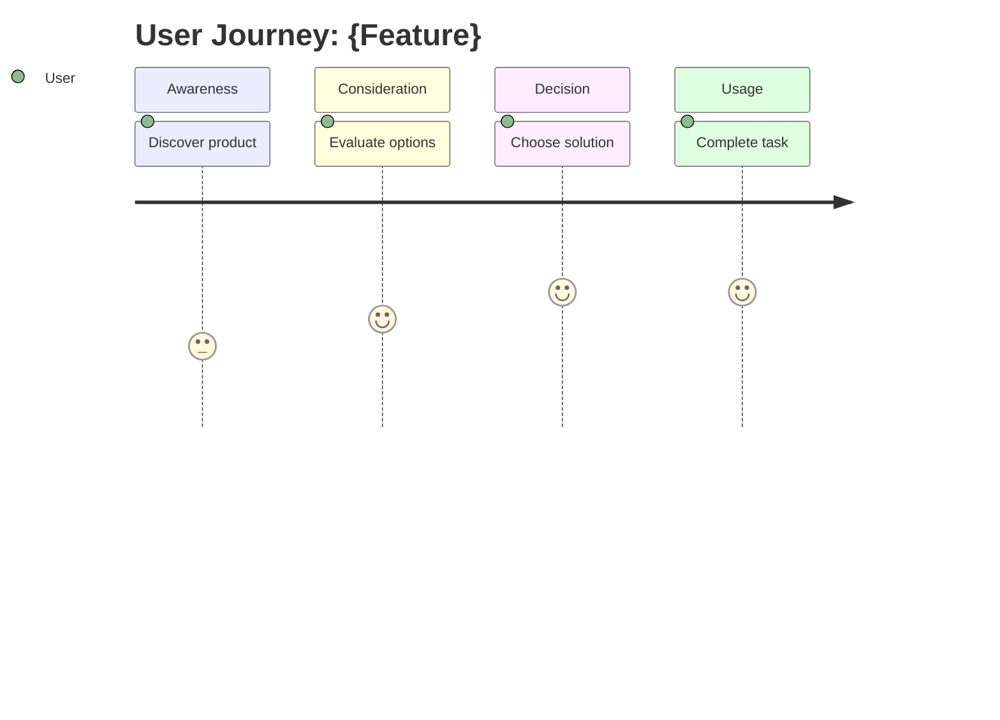
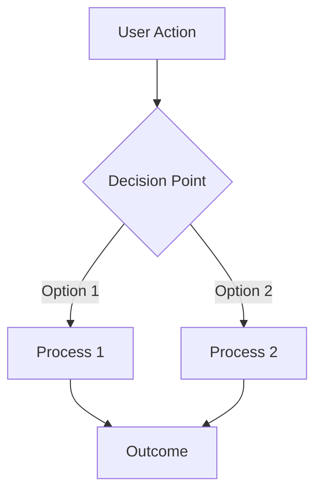
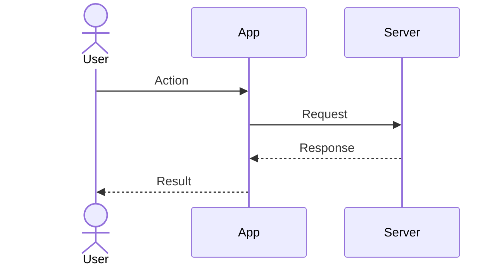

# Feature Design Skill

Design software features from a product owner perspective. Analyze market, understand users, define value proposition, and create user stories—all before implementation planning.

## When to Use

- Starting a new feature or product
- Analyzing product-market fit
- Defining product strategy
- Creating user personas and journeys
- Planning go-to-market strategy

## When NOT to Use

- Implementation planning (use `planning` skill)
- Technical architecture (use `feature-dev` skill)
- Simple bug fixes or enhancements

## Core Principles

- **Check memory first**: Before exploration, search memory for existing knowledge
- **Market-driven**: Understand market before building
- **User-centric**: Ground decisions in user needs
- **Business-aware**: Consider positioning and strategy
- **Visual communication**: Use diagrams for clarity
- **Store findings in memory**: After research, store valuable discoveries
- **Modular documents**: Distribute to team members

## Related Skills

| Skill | When to Use |
|-------|-------------|
| `mermaidjs-v11` | Create business flows, user journeys, sequence diagrams |
| `planning` | After design approved, create implementation phases |
| `feature-dev` | Implement the designed feature |

## Storage Structure

```
agent-workspace/features/feature-name/
├── design/                      # THIS SKILL
│   ├── overview.md              # Hub file (links to all docs)
│   ├── market/
│   │   ├── analysis.md          # Market size, trends, opportunities
│   │   ├── competitors.md       # Competitive analysis matrix
│   │   └── positioning.md       # Product positioning, differentiation
│   ├── users/
│   │   ├── personas.md          # Target user personas
│   │   └── journeys.md          # User journey maps (mermaid)
│   ├── product/
│   │   ├── problem-statement.md # Problem, goals, non-goals
│   │   ├── value-proposition.md # Value prop, benefits, differentiation
│   │   └── business-flows.md    # Business flow diagrams (mermaid)
│   ├── stories/
│   │   ├── epic-1-{name}.md     # User stories per epic
│   │   └── ...
│   ├── go-to-market/
│   │   ├── strategy.md          # Launch strategy, channels
│   │   └── messaging.md         # Key messages, positioning
│   └── assets/                  # Figma exports, screenshots
├── plan/                        # From planning skill
└── implementation/              # From feature-dev skill
```

## The 7 Phases

### Phase 1: Discovery

**Goal**: Understand the feature idea

**Actions**:

1. Create todo list with all phases
2. Ask user for initial context:
   - What is the feature/product idea?
   - What problem does it solve?
   - Who is the target audience?
   - Any constraints or requirements?
3. Summarize understanding and confirm

### Phase 2: Market Research

**Goal**: Understand market landscape and competition

**CRITICAL: Check Memory First**

Before launching research agents, use the `memory` skill to search for existing knowledge. If sufficient context exists, skip or reduce agent exploration.

**Actions**:

1. **Check memory** for existing market knowledge (see above)
2. Launch `market-analyst` agent to:
   - Analyze market size and trends
   - Identify competitors and their offerings
   - Find market gaps and opportunities
   - Suggest positioning angles

   **Example prompts**:
   - "Analyze the market for [feature category] targeting [audience]"
   - "Research competitors offering [similar solution]"

3. Present findings to user:
   - Market overview
   - Competitor matrix
   - Opportunity analysis
4. **Store valuable discoveries in memory**: Use the `memory` skill to document findings in the codebase

5. **Ask if any areas need deeper research**

See [agents/market-analyst.md](agents/market-analyst.md) for details.

### Phase 3: User Research

**Goal**: Understand target users deeply

**Actions**:

1. Launch `user-researcher` agent to:
   - Define user segments
   - Create detailed personas
   - Identify needs and pain points
   - Map user behavior patterns

   **Example prompts**:
   - "Research user needs for [target audience] who want to [goal]"
   - "Develop personas for [product] users"

3. Present findings:
   - Primary and secondary personas
   - Needs matrix
   - Pain points to address
4. **Store valuable discoveries in memory**: Use the `memory` skill to document findings in the codebase

5. **Confirm personas with user**

See [agents/user-researcher.md](agents/user-researcher.md) for details.

### Phase 4: Product Definition

**Goal**: Define problem, solution, and value proposition

**Actions**:

1. Create `product/problem-statement.md`:
   - Problem description
   - Target users (reference personas)
   - Goals and non-goals
   - Success criteria

2. Create `product/value-proposition.md`:
   - Core value proposition
   - Key benefits
   - Differentiation from competitors
   - Why now (timing)

3. **Present and get user approval**

### Phase 5: Business Flows

**Goal**: Visualize key business processes

**Actions**:

1. Identify key flows to diagram:
   - User journey (end-to-end)
   - Core feature flow
   - Decision points
   - Integration touchpoints

2. Create diagrams using `mermaidjs-v11`:
   ```mermaid
   journey
       title User Journey: Creating an E-Card
       section Discovery
         Find template: 5: User
         Preview options: 4: User
       section Creation
         Customize card: 5: User
         Add content: 4: User
       section Sharing
         Generate link: 5: User
         Share with guests: 5: User
   ```

3. Document in `product/business-flows.md` and `users/journeys.md`

4. **Review diagrams with user**

### Phase 6: User Stories

**Goal**: Break feature into implementable stories

**Actions**:

1. Group functionality into epics
2. Create `stories/epic-{n}-{name}.md` for each:

   ```markdown
   # Epic {n}: {Name}

   ## Summary
   {What this epic delivers}

   ## User Stories

   ### Story 1: {Title}
   **As a** {persona}
   **I want to** {action}
   **So that** {benefit}

   **Acceptance Criteria**:
   - [ ] Criterion 1
   - [ ] Criterion 2

   ## Dependencies
   - {Other epics or external}

   ## Notes
   {Design decisions, edge cases}
   ```

3. **Present epic breakdown for approval**

### Phase 7: Go-to-Market

**Goal**: Plan launch and marketing strategy

**Actions**:

1. Create `go-to-market/strategy.md`:
   - Launch approach (soft/hard launch)
   - Target channels
   - Timeline milestones
   - Success metrics

2. Create `go-to-market/messaging.md`:
   - Key messages by audience
   - Positioning statement
   - Taglines and hooks
   - FAQ for common objections

3. Create `overview.md` hub linking all documents

4. **Present complete design for final approval**

## Document Templates

### overview.md (Hub)

```markdown
# {Feature Name} Design

## Status
- Market Research: [x]
- User Research: [x]
- Product Definition: [~]
- Business Flows: [ ]
- User Stories: [ ]
- Go-to-Market: [ ]

## Summary
{One paragraph feature description}

## Documents
- [Market Analysis](./market/analysis.md)
- [Competitors](./market/competitors.md)
- [Positioning](./market/positioning.md)
- [Personas](./users/personas.md)
- [User Journeys](./users/journeys.md)
- [Problem Statement](./product/problem-statement.md)
- [Value Proposition](./product/value-proposition.md)
- [Business Flows](./product/business-flows.md)
- [Epic 1: {name}](./stories/epic-1-{name}.md)
- [Launch Strategy](./go-to-market/strategy.md)
- [Messaging](./go-to-market/messaging.md)

## Key Decisions
- {Decision 1}
- {Decision 2}

## Risks
- {Risk 1}
- {Risk 2}

## Next Steps
→ Use `planning` skill to create implementation phases
```

### competitors.md

```markdown
# Competitive Analysis

## Competitor Matrix

| Feature | Us | Competitor A | Competitor B |
|---------|-----|--------------|--------------|
| Feature 1 | ✓ | ✓ | ✗ |
| Feature 2 | ✓ | ✗ | ✓ |
| Pricing | $X | $Y | $Z |

## Detailed Analysis

### Competitor A
- **Strengths**: ...
- **Weaknesses**: ...
- **Opportunity**: ...

### Competitor B
- **Strengths**: ...
- **Weaknesses**: ...
- **Opportunity**: ...

## Our Differentiation
{How we stand out}
```

### personas.md

```markdown
# User Personas

## Primary Persona: {Name}

**Demographics**:
- Age: X-Y
- Role: {job/context}
- Tech proficiency: {level}

**Goals**:
- {Goal 1}
- {Goal 2}

**Pain Points**:
- {Pain 1}
- {Pain 2}

**Needs**:
- Must have: {critical needs}
- Should have: {important needs}
- Nice to have: {bonus needs}

**Quote**: "{Something they might say}"

## Secondary Persona: {Name}
{Brief description}
```

## Mermaid Diagram Examples

### User Journey


### Business Flow


### Sequence Flow


## Example Usage

```
User: Design a premium e-card feature

Claude: [Phase 1] Let me understand what you need...
        - What type of e-cards?
        - Who is the target audience?
        - Any specific requirements?

User: Wedding invitations for couples, premium tier

Claude: [Phase 2] Launching market-analyst agent...
        Found: $2.3B digital invitation market
        Key competitors: Paperless Post, Canva, Greenvelope
        Opportunity: Premium Vietnamese market underserved

Claude: [Phase 3] Launching user-researcher agent...
        Primary persona: "Mai" - engaged professional, 28-35
        Key needs: Beautiful templates, easy customization, RSVP tracking

Claude: [Phase 4] Creating product definition...
        Problem: Couples want premium digital invitations
        Value prop: Culturally relevant, premium designs with modern features

Claude: [Phase 5] Creating business flow diagrams...
        [User journey diagram]
        [Card creation flow]

Claude: [Phase 6] Breaking into epics...
        Epic 1: Template Gallery
        Epic 2: Card Editor
        Epic 3: RSVP Management
        Epic 4: Sharing & Distribution

Claude: [Phase 7] Go-to-market strategy...
        Soft launch to existing users
        Target: Wedding season timing
        Messaging: "Premium invitations, modern convenience"
```

## Checklist

- [ ] Market research completed with agents
- [ ] User personas defined and confirmed
- [ ] Problem statement clear
- [ ] Value proposition differentiated
- [ ] Business flows visualized (mermaid)
- [ ] User stories in epics
- [ ] Go-to-market strategy defined
- [ ] overview.md links all documents
- [ ] User approved final design

## Integration Flow

```
feature-design → planning → feature-dev
(what & why)    (how)      (build)
     ↓              ↓            ↓
  design/        plan/     implementation/
```
